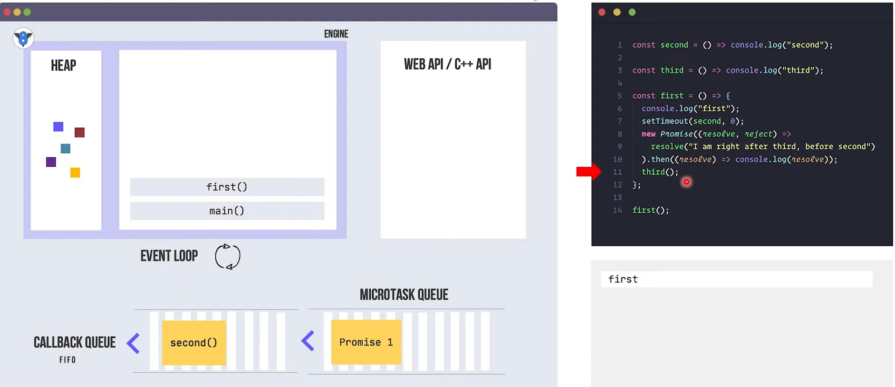

## What is JS and Purpose of it

- The JavaScript is text-based programming language (Scripting Lang) for the Web. It can be used for both client and server-side application.
- JavaScript can update and change both HTML and CSS.
- JavaScript can calculate, manipulate and validate data.

## What are Data types in JS

JavaScript provides different data types to hold different types of values. There are two types of data types in JavaScript.

- Primitive data type
- Non-primitive (reference) data type

### Primitive data types:

- Primitive data types are a set of basic data types (predefined) from which all other data types are constructed and it has no additional methods.
- They are the building blocks of data manipulation and cannot be further divided into simpler data types.

ex - String , Number , Boolean , Null , Undefined

### Non-Primitive Data types:

- Non-Primitive data types are user-defined (not predefined) data types that refer to instances or objects.
- They cannot store the `value` of a variable directly in memory. They store a `memory address` of the variable.
- Whenever a non-primitive data type is defined, it refers a memory location where the data is stored in heap memory.
- These data types are used to store multiple values.

ex - Object , Array , RegExp

## What is var , let and Const

## Explain Diff btw number data type and BigInt

## Explain about Control statement and diff btween if else if and switch

## What is Object and Array

## Explore All Array Methods and String Methods

## Diff between forEach() Map() and filter()

## Diff between slice and splice

## Diff btw == and ===

## What is for..in and for.. of

## What is DOM and DOM Manipulation

## What are call() apply() bind()

- Predefined JavaScript methods.
- Used to couple a function with an object.
- Used to control where `this` should refer.
- call() and apply() methods provides new value of `this` and calls the function immediately.
- bind() method sets `this` keyword and returns a constructor function.

Example - 1

```js
const person = {
  name: "Rohan",
  age: 24,
};

function showDetails(gender, hobby) {
  this.gender = gender;
  this.hobby = hobby;
  console.log(this.name, this.age);
}

showDetails.call(person, "Male", "Reading Books");

showDetails.apply(person, ["Male", "Reading Books"]);

const mybind = showDetails.bind(person, "Male", "Reading Books");
mybind();
```

Example - 2

```js
// Find Min element
let arr = [4, 10, 5, 9, 2, 7];
// let min = Math.min(...arr);
let min = Math.min.apply(Math, arr);
console.log(min);
```

Example - 3

```js
// Concatenate array
let arr1 = [1, 2, 3, 4];
let arr2 = [5, 6, 7];
// arr1.push(...arr2);
arr1.push.apply(arr1, arr2);
console.log(arr1);
```

### What is Promise and Explain Promise

### What is Promise Chain

### Drawback of Callbacks and what is callback chain

### What is aync await

### In how many ways we can handle Promise

### Why do we need Promise

### Explain Clousers, Why do we need it

- A closure is the combination of a function bundled together with references to its surrounding state (the lexical environment).
- A closure allows a function to access variables and other data from the outer scope, even after the outer function has returned (executed ).

In other words,

- closure is a `function instance` remembering its outer variables even after the outer function has executed.

### Advantages of closures

1. They provide `data encapsulation`.
2. Time optimization
3. They help to remove redundant code.
4. They help you to write neat and `modular code`.

_Encapsulation: Closures allow you to create private variables and functions that are inaccessible from the outside world, which helps to keep your code modular and organized._

### Disadvantages of closures

1. The variables declared inside a closure are `not garbage collected`.
2. Too many closures can `slow down your application`. This is actually caused by duplication of code in the memory.

Example - 1

```js
function grand(a) {
  return function parent(b) {
    return function son(c) {
      return function grandson(d) {
        console.log(a + b + c + d);
      };
    };
  };
}
const fun1 = grand(10);
const fun2 = fun1(8);
const fun3 = fun2(6);

// console.dir(fun1);
// console.dir(fun2);
console.dir(fun3);
```

Example - 2 (data encapsulation)

```js
function temporary() {
  let counter = 0;
  return function () {
    counter++;
    console.log(counter);
  };
}

const add1 = temporary();
const add2 = temporary();

add1();
add1();

add2();
```

### Explain Fetch

The fetch() method in JavaScript is used to request data from a server. The request can be of any type of API that returns the data in JSON or XML. The fetch() method requires one parameter, the URL to request, and returns a `promise`.

## Why we need to handle then() two times in fetch

To convert stream

## What is OOPs and Explain its Features

https://www.geeksforgeeks.org/introduction-object-oriented-programming-javascript/

## What is Spread Operetor ?

The JavaScript spread operator ( ... ) allows us to quickly copy all or part of an existing array or object into another array or object.

## What is Rest Parameter ?

The rest parameter is an improved way to handle function parameters, allowing us to more easily handle various inputs as parameters in a function. The rest parameter syntax allows us to represent an indefinite number of arguments as an array. With the help of a rest parameter, a function can be called with any number of arguments, no matter how it was defined. Rest parameter is added in ES2015 or ES6 which improved the ability to handle parameter.

### What is diff btw spread OPerator and rest Parameter

## Explain about this keyword in JS

## Explain Prototype

### What is event

### Explain Event Propagation

### Explain diff btween Event Bubbling and Event Capturing

### How can we restrict Event Bubbling and Event Capturng behaviour

### What is diff between normal function and arrow function

### What are the states of Promise Object

### What is Generator function in JS

### How to compare Object and How to find the Object is empty or not

### What is Set

### SetTimeout and setInterval

### What is Browser Object Model (BOM)

BOM stands for Browser Object Model.
The BOM is not part of the core JavaScript language specification.
A set of APIs that are implemented by the browser.
That provide access to the web browser's `window` and `document` objects, and other `browser-specific functionality`, such as the ability to manipulate the browser's history, location, and cookies.

## Explain Storages of Browser

## Regular Expressions

A regular expression is a sequence of characters that forms a `search pattern`.

The search pattern can be used for text search and text replace operations.

Uses -

- Validate User Input
- Search Inside text

## What is Hositing

- Hoisting is JavaScript's defalt behavior of moving `declarations` to the top.
- This means a function or a variable can be used before it has been declared.
- Javascript hoists only `declarations` not `initialization`

| Keywords | Top                                         | Same Line                                                  |
| -------- | ------------------------------------------- | ---------------------------------------------------------- |
| var      | Declaration + Memory Allocation (undefined) | Assign Value                                               |
| let      | Declaration                                 | Memory Allocation (undefined) + Assign Value               |
| const    | x                                           | Declaration + Memory Allocation (undefined) + Assign Value |

## What is Shadowing

- Variable shadowing occurs when a variable declared within a certain scope (decision block, method, or inner class) has the same name as a variable declared in an outer scope. This outer variable is said to be shadowed.

- If there is a variable in the global scope, and you'd like to create a variable with the same name in a function. The variable in the inner scope will temporarily shadow the variable in the outer scope.

## Diff between var, let and Const

| Var                                                                | Let                                                                | const                                                               |
| ------------------------------------------------------------------ | ------------------------------------------------------------------ | ------------------------------------------------------------------- |
| var has the function or global scope.                              | let's have the block scope.                                        | const variable has the block scope.                                 |
| It gets hoisted to the top of its scope and initialized undefined. | It also got hoisted to the top of its scope but didn't initialize. | It also got hoisted to the top of its scope but didn't initialize.  |
| It can be updated or re-declared.                                  | It can only be updated and can't be re-declared.                   | It can't be updated or re-declared.                                 |
| It's an old way to declare a variable.                             | It's a new way to declare variables introduced in ES6.             | It's also a new way to declare a variable, which introduces in ES6. |

## Explain Module Concept in JS

- In JavaScript, a module is a self-contained unit of code that can be used to encapsulate related functions, variables, and objects.
- Modules allow developers to create reusable code that can be shared and imported by other parts of an application, making it easier to organize and maintain large codebases.

Example -

```js
var Module = (function () {
  function privateMethod() {
    // do something
    console.log("Private Data..");
  }
  return {
    publicMethod: function () {
      // can call private methods
      privateMethod();
    },
  };
})();

Module.privateMethod(); // throw error
Module.publicMethod(); // Private data..
```

## Currying

- It's a programming paradigm or pattern.
- Currying is a technique in functional programming where a function is transformed into a sequence of functions, each taking a single argument.

- The idea is to break down a function that takes multiple arguments into a series of functions that each take a single argument.
- This allows you to partially apply arguments to the function, creating a new function that takes the remaining arguments.

Example - 1

```js
// Normal Function
function multiply(a, b, c) {
  return a * b * c;
}
console.log(multiply(1, 2, 3));

// Curried Version
function curriedMultiply(a) {
  return function (b) {
    return function (c) {
      return a * b * c;
    };
  };
}
console.log(curriedMultiply(1)(2)(3));
```

Example - 2

```js
// Discount Function
function discount(disc) {
  return function (price) {
    return price - price * disc;
  };
}
const tenPercentDiscount = discount(0.1);
const twentyPercentDiscount = discount(0.2);

console.log(tenPercentDiscount(500));
console.log(twentyPercentDiscount(1200));
```

Example - 3

```js
// function curry(func) {
//   return function curried(...args) {
//     // 'func.length' returns no of args it is accepting
//     if (args.length >= func.length) {
//       return func.apply(this, args);
//     } else {
//       return function (...args2) {
//         return curried.apply(this, [...args, ...args2]);
//       };
//     }
//   };
// }

function curry(func) {
  return function curried(...args) {
    // 'func.length' returns no of args it is accepting
    if (args.length >= func.length) {
      return func(...args);
    } else {
      return function (...args2) {
        return curried(...args, ...args2);
      };
    }
  };
}

function sum(a, b, c, d) {
  return a + b + c + d;
}

let curriedSum = curry(sum);

console.log(curriedSum(1, 2, 3, 4));
console.log(curriedSum(1)(2, 3, 4));
console.log(curriedSum(1, 2)(3, 4));
console.log(curriedSum(1, 2, 3)(4));
```

We can use `_.curry()` Method from Lodash Library.

## Debouncing

- In JavaScript, debouncing is a technique used to control the rate at which a function is executed.
- Used to optimize event handling
- The idea is to wait for a certain amount of time after the last invocation of a function before actually executing it, in order to prevent multiple, rapid consecutive invocations.
- This is often useful in situations where a function is attached to an event that is triggered frequently, such as a window resize event or an input field's keyup event.

Example - 1

```js
let id;
function debounce(func) {
  if (id) {
    clearTimeout(id);
  }

  id = setTimeout(func, 2000);
}

function postRequest() {
  console.log("request send ...");
}

// debounce(postRequest); // 10 sec
// debounce(postRequest); //10.1 sec
// debounce(postRequest); // 10.2 sec

debounce(postRequest);

setTimeout(() => {
  debounce(postRequest);
}, 3000);
setTimeout(() => {
  debounce(postRequest);
}, 4000);
```

Example - 2 (Polyfill)

```js
const myDebounce = (callback, delay) => {
  let id;
  return function (...args) {
    if (id) {
      clearTimeout(id);
    }
    id = setTimeout(() => {
      callback(...args);
    }, delay);
  };
};

const debounce = myDebounce(() => {
  console.log("req send ..");
}, 1000);
debounce();
debounce();
debounce();
```

## Throttling

- Throttling is a technique used in JavaScript to limit the number of times a function can be called within a specified time interval.
- Used to optimize event handling

Example - 1 (Throttle Polyfill)

```js
const myThrottle = (callback, delay) => {
  let prev = 0;
  return function (...args) {
    let curr = new Date().getTime();
    if (curr - prev < delay) {
      return;
    }
    prev = curr;
    return callback(...args);
  };
};

const throttle = myThrottle(() => {
  console.log("req send ..");
}, 1000);
throttle();
throttle();
throttle();
```

### Async vs defer

## What is Execution Context

An environment in which the JavaScript code is executed.

When the JavaScript engine scans a script file, it makes an environment called the Execution Context that handles the entire transformation and execution of the code.
There are two types of execution contexts: <b>global</b> and <b>function</b>.

1. The global execution context is created when a JavaScript script first starts to run, and it represents the global scope in JavaScript.

2. A function execution context is created whenever a function is called, representing the function's local scope.

## What are the Phases of Execution Context

There are two phases of JavaScript execution context:

<b> Creation phase:</b>

1. Set `this`
2. creates `arguments` object
3. Stores the variables with values as `undefined` and function `references`

<b> Execution phase: </b>

1. assign the values to variables and call functions.

## What is the Call Stack?

A Stack used to keep the track of all the contexts, including global and functional. A call stack is also known as an 'Execution Context Stack', 'Runtime Stack', or 'Machine Stack'.

## What is Event loop

The event loop is a key mechanism in JavaScript's runtime environment that manages the execution of asynchronous code.



## Difference between Event loop in JavaScript and Event loop in nodejs

The event loop is a critical component of both Node.js and JavaScript, but there are some important differences between the two.

In JavaScript, the event loop is a part of the browser's runtime environment, and it manages the execution of asynchronous code. When an asynchronous operation is started, such as a network request or a setTimeout() call, the event loop schedules the callback function to run once the operation completes. The event loop is responsible for continuously monitoring the call stack and the task queue, and it ensures that the callback functions are executed in the correct order.

In Node.js, the event loop is also responsible for managing the execution of asynchronous code, but it operates in a different way compared to the browser's event loop. Node.js uses the libuv library to implement its event loop, which allows it to handle I/O operations more efficiently. When a Node.js application starts, it initializes the event loop and begins processing incoming requests. Each request is processed asynchronously, and the event loop schedules the corresponding callback function to run when the operation completes. Node.js also includes several other features, such as the ability to create child processes and handle streams, that require more sophisticated event loop management.

In summary, while the basic function of the event loop is similar in both JavaScript and Node.js, the way it is implemented and its capabilities differ. Node.js has a more complex and powerful event loop that allows it to handle a wider range of I/O operations and other tasks.
